# Activitat 4
                                                                                                                                        
 **4.1.-** Crea un usuari admin que es digui adminXYZ, on XYZ són les inicials del teu nom:                                      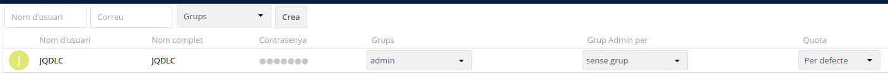
 
**4.2.-** Inicia sessió com a l'usuari adminXYZ.                                                                              
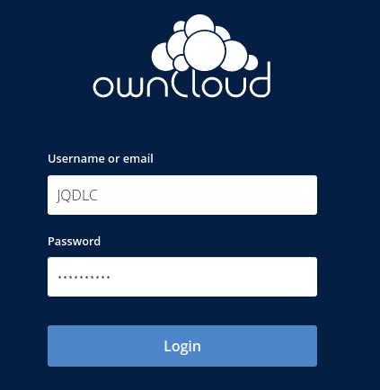

**4.3.-** Crea un usuari XYZ on XYZ son les inicials del company/a i afegeix-lo al grup usuaris, aquest usuari tindrà una quota de 512 MB.

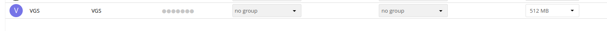

**4.4.-** Podem crear fitxers d'una mida determinada a Linux amb la comanda:

`truncate -s 10M file.txt`.

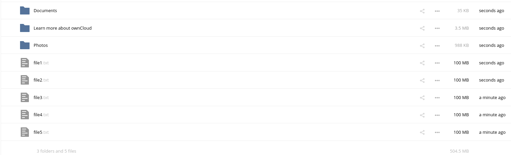

**4.5.-** Mostra el missatge d'error per haver superat la quota d'usuari.

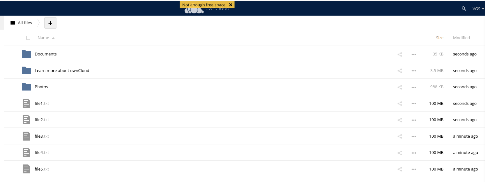

**4.6.-** Busca al teu perfil quin percentatge de quota estas utilitzant.                                                      **Esta usant el 96%**

**4.7.-** Canvia la quota de l'usuari a 1GB i mostra tots els fitxers pujats.

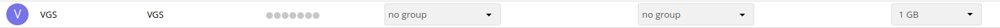
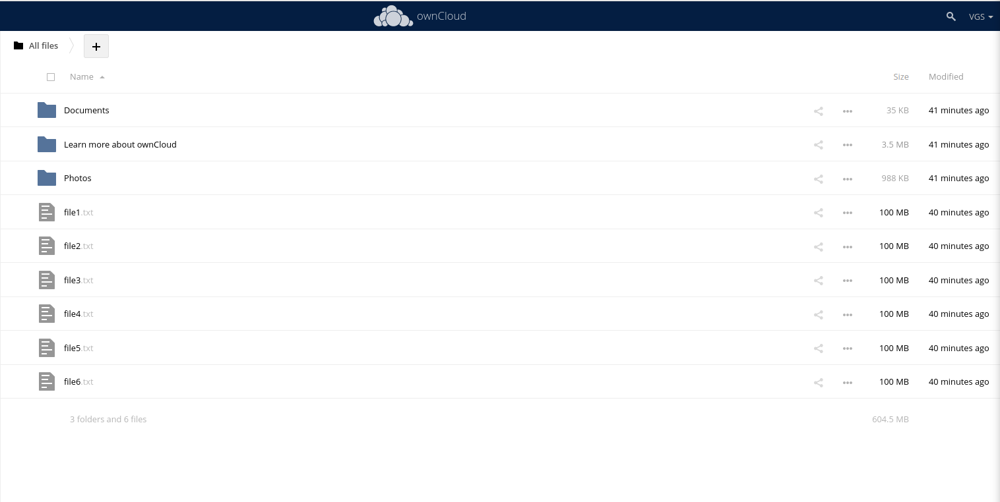

**4.8.-** Crea un usuari anomenat usuari2XYZ i fical al grup usuaris.                                                                     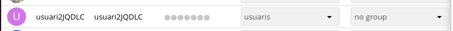

**4.9.-** Comparteix un fitxer de usuariXYZ a usuari2XYZ i mostra com l'usuari2XYZ pot veure i descarregar el fitxer.
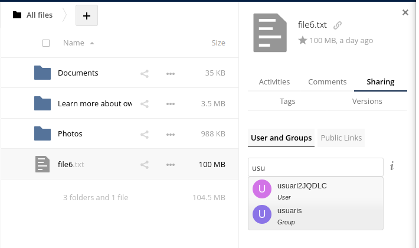
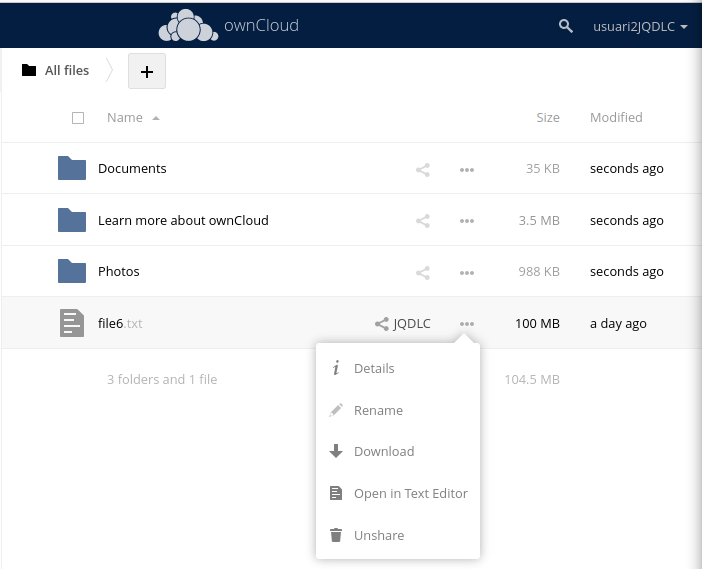

**4.10.-** Esborra la carpeta Learn more about owncloud.
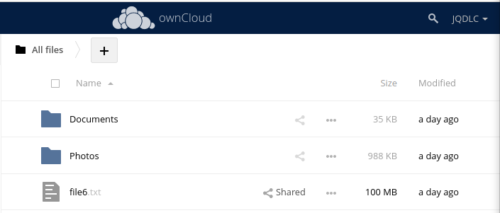

**4.11.-** Recupera la carpeta Learn more about owncloud.
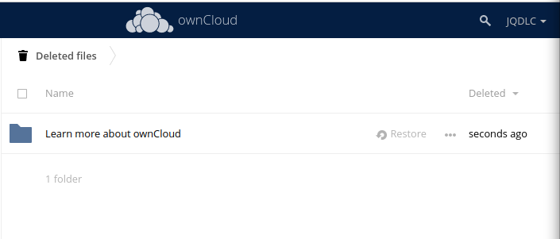

**4.12.-** Com a usuariXYZ crea una carpeta nova anomenada shared i comparteix-la amb l'usuari usuari2XYZ.
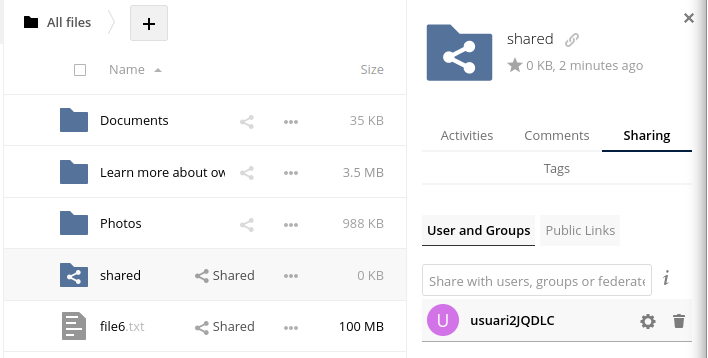

**4.13.-** Entra a Market instal·la dues aplicacions que no estiguin ja instal·lades i explica què fan i com funcionen.

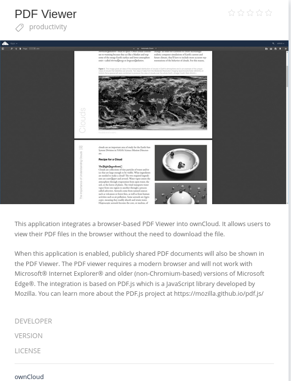

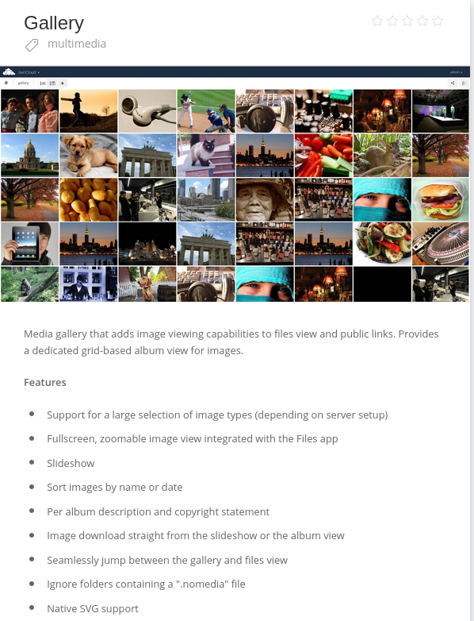
Aquest add-on serveix per poder veure les imatges que penguem al ownclowd
